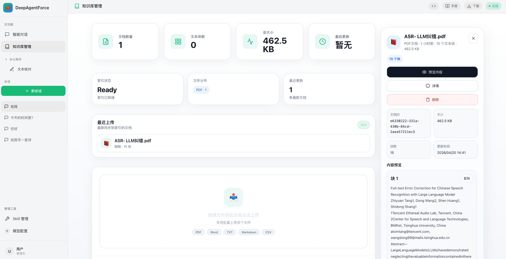

# DeepAgentForce

[](https://www.python.org/)
[](https://fastapi.tiangolo.com/)
[](https://github.com/deepagents/deepagents)
[](./LICENSE)

DeepAgentForce 是一个基于 DeepAgents 框架构建的闭环智能体协同系统。它不仅具备传统 RAG 的知识检索能力，更通过 动态 Skill 注入 和 用户偏好深度挖掘 (Persona Mining)，实现了“越用越懂你”的个性化执行体验。

---

## ✨ 核心特性

### 1. Agent Skills的模块化扩展机制

本项目在 `/src/services/skills` 目录下提供了两个示例 Skills，抛砖引玉：
- **pdf-processing** - PDF 文档处理能力
- **rag-query** - RAG能力
- **web-search** - 联网搜索能力

#### 🔌 零配置扩展机制
- **即放即用**: 根据 Agent Skills 规范编写新的 Skill 后，直接放入 `skills/` 目录即可


#### 📝 [Skill 开发规范](https://platform.claude.com/docs/en/agents-and-tools/agent-skills/overview)


- `SKILL.md` - 技能说明文档，定义能力和使用方法
- `scripts` - 执行脚本 - 实现复杂逻辑


### 2. 👤 动态用户画像 (Persona Mining)
利用  `UserPreferenceMining ` 服务，系统会实时从原始对话中提取：

- 核心关键词: 用户的职业背景、技术偏好。

- 交互风格: 用户偏好的回答长短、语气。

- 上下文注入: 画像会自动转化为系统提示词（System Prompt）的一部分，赋予 Agent 记忆连续性。

### 3. 🌊 深度思考可视化 (Agent Observability)
通过 `WebSocket` 和 `StatusCallback`，前端可以实时追踪 Agent 的每一个微小动作：

- 🔍 Agent Start: 接收任务。

- 🛠️ Tool Call: 正在调用 Shell 执行脚本（含参数展示）。

- ✨ Tool End: 工具返回结果。

- 💬 Final Response: 整合最终回答。

---

## 🚀 快速启动

### 1. 环境准备

确保您的环境已安装 **Python 3.12+**。

```bash
# 1. 克隆仓库
git clone https://github.com/TW-NLP/DeepAgentForce
cd AgentForce

# 2. 环境的准备

- Install Conda: please see https://docs.conda.io/en/latest/miniconda.html
- Create Conda env:

``` sh
conda create -n agent -y python=3.12
conda activate agent
pip install -r requirements.txt
# If you are in mainland China, you can set the mirror as follows:
pip install -r requirements.txt -i https://mirrors.aliyun.com/pypi/simple/ --trusted-host=mirrors.aliyun.com
```

```

### 2. 启动 DeepAgentForce

系统由后端 API 和前端 UI 两部分组成。

#### 🟢 启动后端引擎 (Backend)

```bash
# 在项目根目录下运行
python main.py

```

> *后端 API 服务将启动在: http://localhost:8000*

#### 🔵 启动可视化终端 (Frontend)

```bash
# 进入静态资源目录
cd static

# 启动轻量级 Web 服务
python -m http.server 8080

```

### 3. 开始探索

打开浏览器访问可视化终端：
👉 **http://localhost:8080**

---

## 📖 操作指南

### 🔧 模型配置 (Model Config)

首次启动后，点击界面左侧的 **"模型配置"** 图标。
下面的 LLM、Embedding 参数配置需符合 OpenAI 规范。
Tavily 搜索配置请访问：[app.tavily.com](https://app.tavily.com/home) 获取 API Key。

1. **LLM Model Config**: 填入您的模型服务商信息 (API Key, URL, Model Name)。
2. **RAG MOdel Config**: 配置 Embedding 模型参数（RAG服务）。
3. 点击 **保存配置**。系统会自动测试连接并持久化保存配置。
<div align="center">
  
  <br>
  <em>模型配置</em>
</div>

### 📚 构建知识库 (Knowledge Base)

让 AgentForce 学习您的私有数据：

1. 进入 **"知识库" (Knowledge)** 标签页。
2. 拖拽上传文档 (PDF/Markdown/TXT)。
<div align="center">
  
  <br>
  <em>知识库上传</em>
</div>

### 💬 智能交互 (Chat)

回到首页对话框：

* **提问**: "根据上传的财报，分析该公司去年的主要风险点。"
* **Agent 响应**: Agent 将自动识别意图，调用不同的agent进行回复，并综合生成深度回答。

<div align="center">
  
  <br>
  <em>智能交互</em>
</div>

### 👤 用户画像 (User Persona)

回到首页对话框：

* **提问**: "你好 你知道 我喜欢什么吗"
* **Agent 响应**: 你好！😊 根据我们的对话历史，我注意到你是一位深耕自然语言处理（NLP）领域的核心AI实践者——对NLP兴趣浓厚

<div align="center">
  
  <br>
  <em>问答效果展示</em>
</div>


<div align="center">
  
  <br>
  <em>用户画像</em>
</div>


## 🔌 API 开发文档

后端提供标准的 OpenAPI/Swagger 文档。服务启动后，访问 `http://localhost:8000/docs` 即可查看和调试接口。

| 模块 | Endpoint | 描述 |
| --- | --- | --- |
| **Chat** | `POST /chat` | 核心对话接口，触发 Agent 工作流 |
| **History** | `GET /history/saved` | 拉取持久化的历史会话 |
| **GraphRAG** | `POST /graphrag/upload` | 上传文件并触发异步索引任务 |
| **GraphRAG** | `POST /graphrag/query` | 执行图谱增强的深度查询 |
| **System** | `GET /config` | 获取当前系统运行参数 |

---


## Contact

**微信：** NLP技术交流群。


