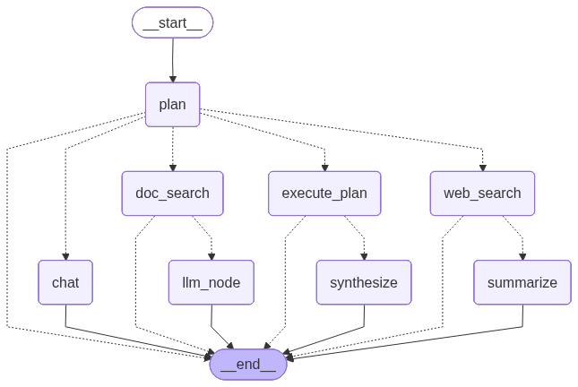
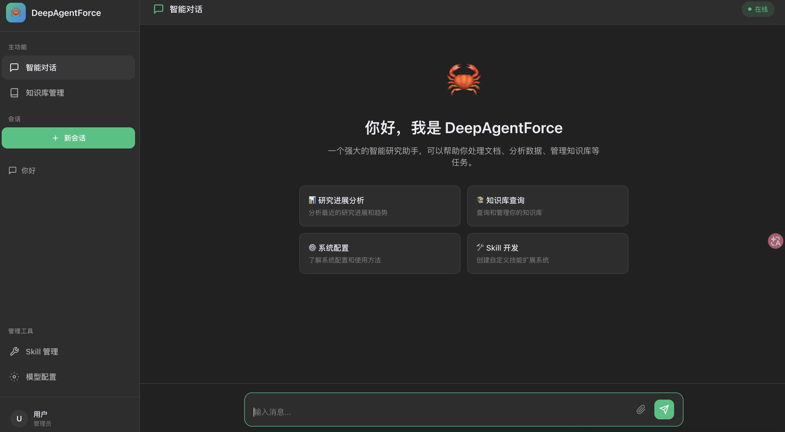
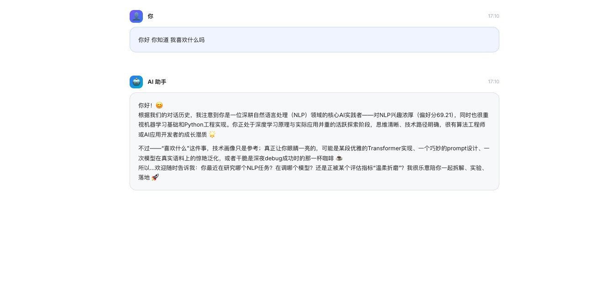
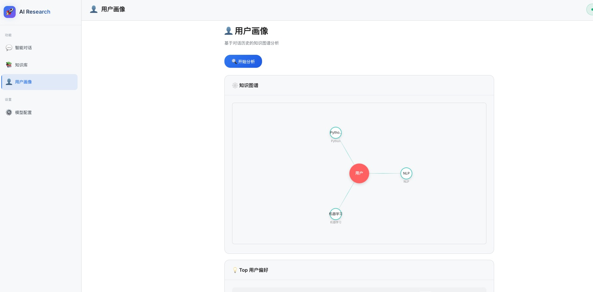

# AgentForce

[](https://www.python.org/)
[](https://fastapi.tiangolo.com/)
[](./LICENSE)

**AgentForce** 是一个融合了 **GraphRAG（图谱增强检索）** 认知能力与 **Agentic Workflow（代理工作流）** 执行能力的下一代智能对话平台。

不同于传统的 RAG 系统，AgentForce 不仅能“检索”片段，更能通过构建知识图谱“理解”全貌，并通过自主代理规划“执行”复杂任务。系统采用现代化的前后端分离架构，旨在为开发者提供开箱即用的深度问答与知识库构建解决方案。
<div align="center">
  
  <br>
  <em>AgentForce 智能执行流程图</em>
</div>

---

## ✨ 核心特性

### 1. ⚡️ Agentic Workflow (代理工作流)
超越简单的问答，AgentForce 具备自主规划能力：
- **动态规划**: Agent 根据问题复杂度，自动判断是否需要查阅知识库、联网搜索或进行多步推理。
- **记忆增强**: 内置会话持久化机制 (`data/saved_history.json`)，支持跨周期的长程记忆与上下文理解。
- **会话隔离**: 完备的 Session 管理体系，支持多用户、多会话并行处理。

### 2. 🕸️ Graph-Powered Knowledge (图谱认知)
基于 GraphRAG 技术，从碎片化信息中重构知识网络：
- **深度理解**: 自动提取实体 (Entities)、构建关系 (Relationships) 并生成社区摘要 (Community Summaries)。
- **全局查询 (Global Query)**: 能够回答 "总结这几份文档的主要冲突点" 等宏观问题，这是传统向量检索无法做到的。
- **多模态支持**: 支持 PDF, DOCX, TXT, MD, CSV 等多种格式的即时索引与可视化状态监控。

### 3. 🎛️ Dynamic Control (动态中枢)
全热更新配置，无需重启服务：
- **模型热切换**: 随时在 GPT-4o, Claude-3.5 或本地模型间切换。
- **工具链集成**: 一键配置 Tavily (联网搜索) 和 Firecrawl (网页爬取) 等外部工具。
- **持久化配置**: 所有系统参数自动保存至 `data/saved_config.json`，确保配置不丢失。


### 4. 👤 User Persona (用户画像)
沉淀对话记忆，构建越用越懂你的专属知识图谱：

- **深度偏好挖掘**: 结合 LLM 语义分析与 NetworkX 图算法 (PageRank)，量化提取用户关注的核心实体与关系。

- **无感异步更新**: 采用 Fire-and-Forget 机制，在会话结束时通过后台线程池静默更新画像，零延迟不阻塞对话。

- **动态侧写生成**: 实时将挖掘结果转化为结构化标签与自然语言摘要，持久化至 data/person_like.json 供前端可视化展示。

## 📂 项目架构

```text
AgentForce/
├── config/                  # [控制中心]
│   ├── __init__.py
│   ├── prompts.py           # Agent 提示词工程
│   ├── saved_config.json    # [自动同步] 系统配置存储
│   ├── saved_history.json   # [自动同步] 对话记忆存储
│   └── settings.py          # 全局配置加载器
├── src/                     # [核心引擎]
│   ├── api/                 # 接口层 (RESTful API & WebSocket)
│   ├── models/              # 数据模型 (Pydantic Schema)
│   ├── services/            # 业务服务 (LLM, GraphRAG, Search)
│   └── workflow/            # 代理大脑 (Agent Nodes & Edges)
├── static/                  # [交互界面] 轻量级 Web UI
│   ├── chat.js              # 对话交互逻辑
│   ├── config.js            # 动态配置逻辑
│   ├── knowledge.js         # 知识库可视化逻辑
│   └── index.html           # 应用入口
├── uploads/                 # [数据缓存] 待处理文件区
├── requirements.txt         # 依赖清单
├── run.py                   # 服务启动入口
└── README.md                # 说明文档

```

---

## 🚀 快速启动

### 1. 环境准备

确保您的环境已安装 **Python 3.12+**。

```bash
# 1. 克隆仓库
git clone https://github.com/TW-NLP/AgentForce
cd AgentForce

# 2. 环境的准备

- Install Conda: please see https://docs.conda.io/en/latest/miniconda.html
- Create Conda env:

``` sh
conda create -n agent -y python=3.12
conda activate agent
pip install -r requirements.txt
# If you are in mainland China, you can set the mirror as follows:
pip install -r requirements.txt -i https://mirrors.aliyun.com/pypi/simple/ --trusted-host=mirrors.aliyun.com
```

```

### 2. 启动 AgentForce

系统由后端 API 和前端 UI 两部分组成。

#### 🟢 启动后端引擎 (Backend)

```bash
# 在项目根目录下运行
python run.py

```

> *后端 API 服务将启动在: http://localhost:8000*

#### 🔵 启动可视化终端 (Frontend)

```bash
# 进入静态资源目录
cd static

# 启动轻量级 Web 服务
python -m http.server 8080

```

### 3. 开始探索

打开浏览器访问可视化终端：
👉 **http://localhost:8080**

---

## 📖 操作指南

### 🔧 模型配置 (Model Config)

首次启动后，点击界面左侧的 **"模型配置"** 图标。
下面的 LLM、Embedding 参数配置需符合 OpenAI 规范。
Tavily 搜索配置请访问：[app.tavily.com](https://app.tavily.com/home) 获取 API Key。

1. **LLM Config**: 填入您的模型服务商信息 (API Key, URL, Model Name)。
2. **GraphRAG Config**: 配置 Embedding 模型参数（RAG服务）。
3. 点击 **保存配置**。系统会自动测试连接并持久化保存配置。
<div align="center">
  
  <br>
  <em>模型配置</em>
</div>

### 📚 构建知识库 (Knowledge Base)

让 AgentForce 学习您的私有数据：

1. 进入 **"知识库" (Knowledge)** 标签页。
2. 拖拽上传文档 (PDF/Markdown/TXT)。
3. 观察控制台，AgentForce 会自动执行 **ETL 流程**：`文本分块` -> `实体提取` -> `关系构建` -> `社区检出`。
<div align="center">
  
  <br>
  <em>知识库上传</em>
</div>

### 💬 智能交互 (Chat)

回到首页对话框：

* **提问**: "根据上传的财报，分析该公司去年的主要风险点。"
* **Agent 响应**: Agent 将自动识别意图，调用不同的agent进行回复，并综合生成深度回答。

<div align="center">
  
  <br>
  <em>智能交互</em>
</div>

### 👤 用户画像 (User Persona)

回到首页对话框：

* **提问**: "你好 你知道 我喜欢什么吗"
* **Agent 响应**: 你好！😊 根据我们的对话历史，我注意到你是一位深耕自然语言处理（NLP）领域的核心AI实践者——对NLP兴趣浓厚

<div align="center">
  
  <br>
  <em>问答效果展示</em>
</div>


<div align="center">
  
  <br>
  <em>用户画像</em>
</div>


## 🔌 API 开发文档

后端提供标准的 OpenAPI/Swagger 文档。服务启动后，访问 `http://localhost:8000/docs` 即可查看和调试接口。

| 模块 | Endpoint | 描述 |
| --- | --- | --- |
| **Chat** | `POST /chat` | 核心对话接口，触发 Agent 工作流 |
| **History** | `GET /history/saved` | 拉取持久化的历史会话 |
| **GraphRAG** | `POST /graphrag/upload` | 上传文件并触发异步索引任务 |
| **GraphRAG** | `POST /graphrag/query` | 执行图谱增强的深度查询 |
| **System** | `GET /config` | 获取当前系统运行参数 |

---

## 🛠 技术栈

* **Core**: Python 3.12+, LangChain (Optional), NetworkX
* **Web Framework**: FastAPI, Uvicorn
* **RAG Engine**: GraphRAG, Community Detection Algorithms
* **Frontend**: Vanilla JS (ES6+), HTML5, CSS3
* **Async Task**: Python `asyncio` & FastAPI `BackgroundTasks`


