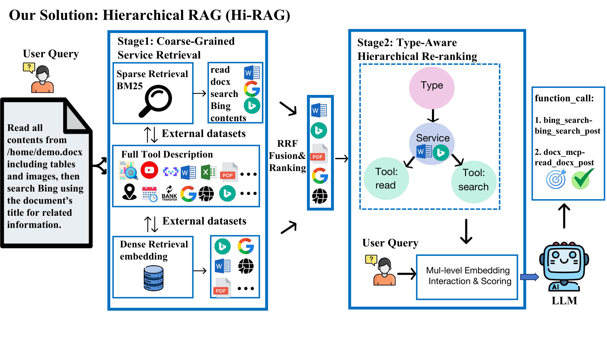

# DeepAgentForce

<p align="center">
  
</p>

<p align="center">
  <strong>面向生产环境的多租户 Agent 运行底座</strong><br>
  <em>Skills、Tools、MCP 三层渐进式披露 — 基于 LangGraph + deepagents</em>
</p>

<p align="center">
  <a href="README.md">🇺🇸 English Docs</a> &nbsp;|&nbsp;
  <a href="https://github.com/TW-NLP/DeepAgentForce">GitHub</a>
</p>

<p align="center">
  
  
  
  
  
  
</p>

---

## 什么是 DeepAgentForce？

DeepAgentForce 是一个 **面向生产环境的 Agent Harness（运行底座）**，为智能体提供一套可持续运行、多用户隔离、按需扩展的宿主环境。

它不是一个聊天页面加一个模型接口。项目关注的是运行层的核心问题：

- Agent 如何在技能数量不断增长时仍保持高效选择（渐进式披露，而不是平铺所有工具）
- 几十甚至几百个工具 / MCP Server 如何在不常驻上下文的情况下按需取用
- 多用户环境下如何做会话、知识、配置、技能的完全隔离
- RAG、工具、用户记忆、自定义逻辑如何连入同一个运行时

---

## 核心差异性

### 1. 渐进式披露 — Skills、Tools、MCP 三层结构

参照 hermes-agent 的执行范式，在 LangGraph + LangChain 上原生重建：

| 层次 | Skills | 内置通用工具 | 额外/MCP 工具 |
|------|--------|-------------|--------------|
| 常驻 system prompt | 仅分类概览 | 全量（15 个工具，schema 小） | 仅 ≤4 个桥接工具 |
| 第一层按需 | `skills_list(category)` → name+description | — | `tool_search` / `mcp_search` → 混合检索 + 重排 |
| 第二层按需 | `skill_view(name)` → 完整 SKILL.md | — | `tool_describe(name)` → 参数 schema |
| 执行层 | `shell` → 运行技能脚本 | 直接调用（已绑定） | `tool_invoke(name, args)` → 代理执行 |

**为什么重要：** 19 个 skill + 50 个 MCP 工具 + 10 个自定义工具的部署，上下文开销始终恒定 — 无论挂多少工具，常驻上下文的只有少数几个桥接工具（≤4）。

```
阈值门控（tool_disclosure.py）：
  extra_tools schema token < 上下文 10%  →  直接绑定（无需桥接层）
  extra_tools schema token ≥ 上下文 10%  →  切换为 Hi-RAG 分层桥接
```

#### Hi-RAG — 分层工具选择（Type → Service → Tool）

面向海量工具 / MCP 场景，披露层采用 **Hi-RAG**：一种结构感知、由粗到精的检索（参照论文 *Hi-RAG: A Hierarchical Framework for Scalable and Generalizable Tool Selection*），契合 MCP 天然的 `Type → Service → Tool` 层级：

<p align="center">
  
</p>

- **阶段 1 · 粗粒度检索（混合）：** 在**工具**描述上做 BM25（词法）+ embedding（语义），用加权 RRF（`k=60, α=0.1`）融合 —— *Tool-as-Proxy*：先检索工具，再上卷到其父服务。
- **阶段 2 · 细粒度重排（Type 感知）：** 候选按 `Type + Service + Tool` 拼接描述做 embedding 余弦重排，只把 top 结果交给 LLM。
- **两个入口：** `tool_search`（自定义工具，`Type → Tool` 两层）与 `mcp_search`（MCP，`Type → Service → Tool` 三层）；二者共用 `tool_describe` / `tool_invoke`，**未配置 embedding 时自动退回纯 BM25**。
- 每个 MCP server / 自定义工具携带固定 8 类表里的一个 **Type**，作为重排最粗的一路信号。

### 2. MCP 支持（Model Context Protocol）

与 Claude Desktop 相同的配置格式，一行接入任意 MCP Server：

```json
{
  "mcpServers": {
    "slack":  { "command": "npx", "args": ["-y", "@modelcontextprotocol/server-slack"] },
    "github": { "url": "https://my-mcp-server/github", "headers": { "Authorization": "Bearer ..." } }
  }
}
```

- 支持 `stdio`、`streamable_http`、`sse` 三种传输方式
- 多租户：全局共享配置 + 租户级覆盖文件
- 工具名自动加 `mcp__<server>__<tool>` 前缀，防止冲突
- MCP 工具为异步专用，`tool_invoke` 内部走 `ainvoke`
- 支持通过 Web UI 添加、测试连接、启用/禁用

### 3. 多租户从底层设计

每项资源均绑定 `tenant_uuid`：

| 资源 | 隔离方式 |
|------|---------|
| 聊天会话 | `thread_id = tenant_uuid + session_id` |
| RAG 知识库 | ChromaDB 每租户独立 collection |
| Skills | 共享内置 + 私有 `data/skill/<uuid>/` 目录 |
| MCP 配置 | 全局只读 + `data/mcp_servers_<uuid>.json` |
| 自定义工具 | `data/agent_tools_custom/<uuid>/` |
| 用户画像 | 每用户独立 PageRank 偏好图谱 |
| 文件输出 | `data/outputs/<uuid>/` |

### 4. 自定义工具沙箱

用户通过 Web UI 上传 Python 工具，在**独立子进程**中执行，主进程不导入任何用户代码：

- `subprocess` + `rlimit`：CPU 10s、文件 16 MB、内存 1 GB（Linux）
- 墙钟超时：20s
- 环境变量过滤：剔除名称含 `KEY`、`TOKEN`、`SECRET`、`PASSWORD`、`CREDENTIAL` 的变量
- 每次调用独立 session + 临时 cwd
- 通过 `pydantic.create_model` 重建代理工具，保留原始参数 schema

### 5. 标准开源生态

基于 LangGraph + LangChain + deepagents，不是自研 runtime：

| 能力 | 实现 |
|------|------|
| Agent 图 | LangGraph `create_deep_agent` + `MemorySaver` |
| 多轮记忆 | LangGraph `MemorySaver`（按 thread_id） |
| 工具绑定 | LangChain `BaseTool` / `StructuredTool` |
| 模型接入 | `init_chat_model` — 兼容任意 OpenAI 协议 |
| 流式输出 | `astream(stream_mode="messages")` |
| 可观测性 | WebSocket 事件回调（工具调用开始/结束、回答阶段） |

### 6. 内置 RAG 流水线

不是外挂插件，而是运行时的一等能力：

- ChromaDB 本地持久化，每租户独立 collection
- 支持 PDF / DOCX / TXT / CSV / Markdown 入库
- 可选 BM25 混合检索、重排序、Query Rewrite 多路投票
- 通过 `rag-query` skill 在对话中自然调用

### 7. 长期用户记忆

`person_like_service.py` 从对话中抽取实体与关系，构建每用户的 NetworkX 知识图谱，以 PageRank + 连接权重 + 提及频次综合评估偏好。每次会话开始时，Agent 会注入个性化摘要。

---

## 系统架构

```
┌─────────────────────────────────────────────────────────┐
│  前端 (static/)  聊天 · 知识库 · 技能管理 · 模型配置    │
└────────────────────────┬────────────────────────────────┘
                         │ WebSocket / REST
┌────────────────────────▼────────────────────────────────┐
│  接口层 (FastAPI)                                        │
│  routes · auth · skills_routes                           │
│  tools_routes · mcp_routes · websocket                   │
└────────────────────────┬────────────────────────────────┘
                         │
┌────────────────────────▼────────────────────────────────┐
│  Agent 运行时 (ConversationalAgent)                      │
│                                                          │
│  ┌─────────────┐  ┌──────────────┐  ┌────────────────┐  │
│  │  Skills     │  │ 通用工具      │  │ 额外/MCP 工具  │  │
│  │ 渐进披露    │  │  (15 个)     │  │  渐进披露      │  │
│  │skills_list  │  │  utils·web   │  │  tool_search   │  │
│  │skill_view   │  │  memory      │  │  tool_invoke   │  │
│  └─────────────┘  └──────────────┘  └────────────────┘  │
│                                                          │
│  ┌─────────────────────────────────────────────────────┐ │
│  │  LangGraph  create_deep_agent + MemorySaver         │ │
│  └─────────────────────────────────────────────────────┘ │
└──────┬─────────────────────────┬───────────────────┬────┘
       │                         │                   │
┌──────▼──────┐  ┌───────────────▼──────┐  ┌────────▼────┐
│  RAG        │  │  Skill Manager       │  │  沙箱       │
│  ChromaDB   │  │  内置 + 自定义        │  │  rlimit +   │
│  按租户隔离  │  │  skills/<分类>/<名>  │  │  子进程     │
└─────────────┘  └──────────────────────┘  └─────────────┘
```

---

## 内置技能（19 个，5 大分类）

| 分类 | 技能 |
|------|------|
| `design` | algorithmic-art, brand-guidelines, canvas-design, frontend-design, slack-gif-creator, theme-factory, web-artifacts-builder |
| `development` | claude-api, mcp-builder, skill-creator, webapp-testing |
| `document` | docx, pdf, pptx, xlsx |
| `research` | rag-query, web-search |
| `writing` | doc-coauthoring, internal-comms |

每个技能位于 `skills/<分类>/<名称>/SKILL.md` + `scripts/`。Agent 从不一次性加载所有技能，通过 `skills_list` → `skill_view` 按需展开。

---

## 快速开始

### 方式一：Docker（推荐）

```bash
git clone https://github.com/TW-NLP/DeepAgentForce
cd DeepAgentForce
docker compose up -d
```

访问 `http://localhost:8000` → 进入**模型配置**填写 LLM 和 Embedding 的 API Key 即可使用。

### 方式二：本地运行

```bash
git clone https://github.com/TW-NLP/DeepAgentForce
cd DeepAgentForce

conda create -n agent python=3.12 -y
conda activate agent
pip install -r requirements.txt

python main.py
```

国内镜像加速：
```bash
pip install -r requirements.txt \
  -i https://mirrors.aliyun.com/pypi/simple/ \
  --trusted-host=mirrors.aliyun.com
```

`.env` 最小配置：
```bash
SQLITE_DB_PATH=data/deepagentforce.db
JWT_SECRET_KEY=your-secret-key-change-in-production
HOST=127.0.0.1
PORT=8000
```

---

## 上手路径

### 1. 注册并登录
`http://localhost:8000/login.html` — 每位用户自动获得独立工作空间。

### 2. 配置模型
进入**模型配置**，至少填写：

| 配置项 | 示例 |
|--------|------|
| `LLM_URL` | `https://api.openai.com/v1` |
| `LLM_API_KEY` | `sk-xxxxxxxx` |
| `LLM_MODEL` | `gpt-4o` |
| `EMBEDDING_URL` | `https://api.openai.com/v1` |
| `EMBEDDING_API_KEY` | `sk-xxxxxxxx` |
| `EMBEDDING_MODEL` | `text-embedding-3-small` |

### 3. 上传知识文档
支持 PDF、DOCX、TXT、CSV、Markdown，自动入库到租户专属向量索引。

### 4. 配置 MCP Server（可选）
**技能管理 → MCP** → 添加 Server，格式与 Claude Desktop 一致。保存前可点击**测试连接**验证。

### 5. 上传自定义工具（可选）
**技能管理 → 工具** → 添加工具，上传 `.py` 文件。带 docstring 的顶层函数自动变为可调用工具，沙箱隔离执行。

### 6. 开始对话
Agent 自动选择技能、检索知识库、调用工具，并以自然语言综合回答。

---

## 项目结构

```
DeepAgentForce/
├── main.py
├── config/settings.py
├── src/
│   ├── api/
│   │   ├── routes.py              # 核心对话 + 文件路由
│   │   ├── skills_routes.py       # 技能 CRUD
│   │   ├── tools_routes.py        # 自定义工具 CRUD
│   │   ├── mcp_routes.py          # MCP Server CRUD
│   │   ├── auth_routes.py
│   │   └── websocket.py
│   └── services/
│       ├── conversational_agent.py    # Agent 组装入口
│       ├── skill_disclosure.py        # Skills 渐进式披露
│       ├── tool_disclosure.py         # Tools BM25 渐进式披露
│       ├── mcp_integration.py         # MCP 接入 + 配置管理
│       ├── custom_tool_manager.py     # 用户上传 Python 工具
│       ├── sandbox/                   # 子进程沙箱隔离
│       │   ├── runner.py
│       │   ├── loader.py
│       │   └── tool_worker.py
│       ├── agent_tools/               # 15 个内置通用工具
│       │   ├── utils.py
│       │   ├── web.py
│       │   └── memory.py
│       ├── skill_manager.py
│       ├── rag.py
│       └── person_like_service.py
├── src/services/skills/               # 19 个内置技能
│   ├── design/
│   ├── development/
│   ├── document/
│   ├── research/
│   └── writing/
├── static/                            # Web 前端
│   ├── js/i18n.js                     # 中英文切换
│   ├── index.html
│   ├── login.html
│   └── register.html
├── scripts/                           # 测试脚本
│   ├── test_sandbox.py                # 15/15
│   ├── test_mcp_integration.py        # 14/14
│   ├── test_tools_mcp_mgmt.py         # 20/20
│   ├── test_routes_http.py            # 19/19
│   └── test_optimizations.py          # 30/30
└── data/                              # 运行时数据（gitignored）
```

---

## API 概览

Swagger 文档：`http://localhost:8000/docs`

| 接口 | 方法 | 说明 |
|------|------|------|
| `/ws/stream` | WebSocket | 流式对话 |
| `/api/chat` | POST | 同步对话 |
| `/api/chat/upload` | POST | 带附件对话 |
| `/api/auth/register` | POST | 注册 |
| `/api/auth/login` | POST | 登录 |
| `/api/skills` | GET | 获取技能列表 |
| `/api/skills/install` | POST | 安装技能 |
| `/api/tools` | GET | 列出工具（内置+MCP+自定义） |
| `/api/tools/custom` | POST | 上传自定义工具 |
| `/api/mcp/servers` | GET | 列出 MCP Server |
| `/api/mcp/servers` | POST | 新增/更新 MCP Server |
| `/api/mcp/servers/test` | POST | 测试 MCP 连接 |
| `/api/rag/documents/upload` | POST | 上传知识文档 |
| `/api/rag/query` | POST | RAG 查询 |

---

## 📰 更新日志

- **2026-06-07** — `v2.1.0` Hi-RAG 版本
  - Hi-RAG 分层工具选择（`Type → Service → Tool`），参考 *Hi-RAG: A Hierarchical Framework for Scalable and Generalizable Tool Selection*
  - 两个入口：`tool_search`（自定义工具，两层）与 `mcp_search`（MCP，三层），共用 `tool_describe` / `tool_invoke`
  - 混合粗排召回：BM25 + 向量经加权 RRF 融合，再做 Type 感知细排；未配置向量端点时优雅回退到纯 BM25
  - MCP server / 自定义工具固定 8 类 Type 体系（`tool_taxonomy.py`）
  - 无论工具仓库多大，上下文中始终只有 ≤4 个桥接 stub

- **2026-06-02** — `v2.0.0` 渐进式披露版本
  - Skills 渐进式披露：`skills_list` / `skill_view` 两步展开
  - BM25 工具检索：`tool_search` / `tool_describe` / `tool_invoke` 桥接
  - MCP 全面接入（stdio + HTTP，多租户配置管理）
  - 自定义工具 Python 沙箱（子进程 + rlimit）
  - Web 前端：技能 / 工具 / MCP 管理 Tab
  - 15 个内置通用工具（本地实用 + 联网检索 + 记忆会话）
  - 19 个技能重组为 5 大分类
  - 前端中英文切换

- **2026-04-23** — `v1.4.0` Docker 构建优化 + macOS/Windows 打包

- **2026-04-22** — `v1.3.0` 技能 zip 上传、对话体验优化

- **2026-04-21** — `v1.2.0` 新增 20 个 Claude 官方技能，重新生成与编辑功能

---

## 适合什么场景

- 智能体平台课程 / 毕设 / 实验项目
- 企业内部知识助手
- 多用户共享的 AI 工作台
- 可扩展 MCP 工具调用的 Agent 原型
- 面向中文场景的对话 + 校对 + 知识库系统

---

## 常见问题

**Docker 启动后为什么不能直接聊天？**
因为 LLM API Key 默认为空。请先进入**模型配置**填写 `LLM_*` 和 `EMBEDDING_*` 参数。

**如何添加新技能？**
创建一个包含 `SKILL.md` + `scripts/` 的目录，打包为 zip 后通过**技能管理 → 添加技能**上传。或直接放入 `src/services/skills/<分类>/`。

**如何清空 Docker 数据？**
```bash
docker compose down -v
```

---

## License

MIT — 可自由使用、修改和分发，商用无忧。

---

## 致谢

- [LangChain / LangGraph](https://github.com/langchain-ai/langchain) — Agent 开发框架
- [deepagents](https://pypi.org/project/deepagents/) — 技能感知 Agent 构建库
- [FastAPI](https://github.com/tiangolo/fastapi) — 高性能 Web 框架
- [ChromaDB](https://github.com/chroma-core/chroma) — 本地向量存储

---

<p align="center">
  <a href="https://github.com/TW-NLP/DeepAgentForce">
    
  </a>
</p>
